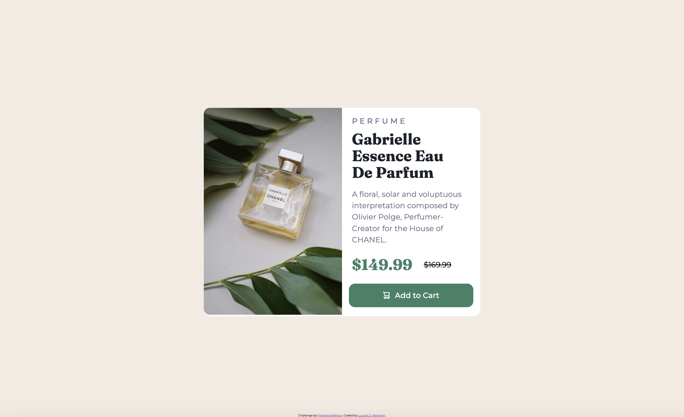
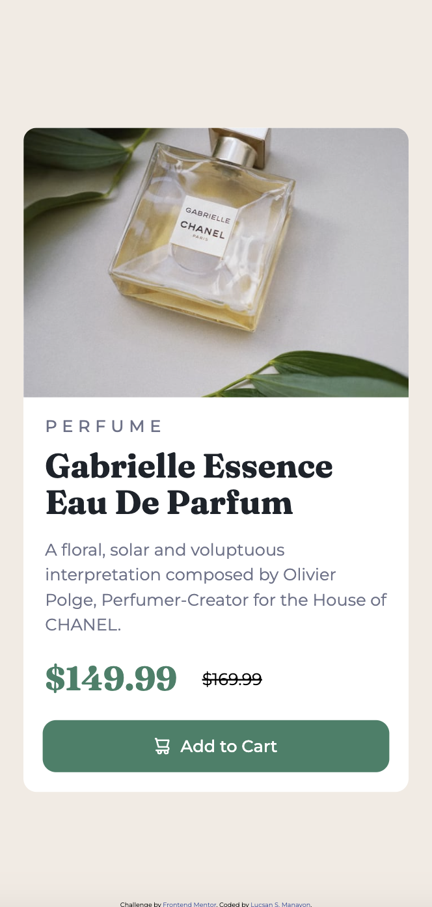

# Frontend Mentor - Product preview card component solution

This is a solution to the [Product preview card component challenge on Frontend Mentor](https://www.frontendmentor.io/challenges/product-preview-card-component-GO7UmttRfa). Frontend Mentor challenges help you improve your coding skills by building realistic projects.

## Table of contents

- [Overview](#overview)
  - [The challenge](#the-challenge)
  - [Screenshot](#screenshot)
  - [Links](#links)
- [My process](#my-process)
  - [Built with](#built-with)
  - [What I learned](#what-i-learned)
  - [Continued development](#continued-development)
- [Author](#author)

## Overview

- Responsive product preview card built for web and mobile

### The challenge

Users should be able to:

- View the optimal layout depending on their device's screen size
- See hover and focus states for interactive elements

### Screenshot





### Links

- Solution URL: [ljmanayon/product-preview-card](https://github.com/ljmanayon/product-preview-card)
- Live Site URL: [github.io/product-preview-card/](https://ljmanayon.github.io/product-preview-card/)

## My process

-mobile first workflow

### Built with

- Semantic HTML5 markup
- CSS custom properties
- Flexbox
- CSS Grid
- Mobile-first workflow
- SASS

### What I learned

-Learned about CSS Grid
-Learned a little bit about SASS and its variables, functions and map.

```scss
$colors: (
  "primedarkCyan": hsl(158, 36%, 37%),
  "primecream": hsl(30, 38%, 92%),
  "neutdarkBlue": hsl(212, 21%, 14%),
  "neutdarkGrayish": hsl(228, 12%, 48%),
  "neutwhite": hsl(0, 0%, 100%),
  @function color($key) {@if map-has-key(
      $map: $colors,
      $key: $key,
    )
    {@return map-get(
      $map: $colors,
      $key: $key,
    ) ;} @warn "Unknown '#{$key}' in $colors." ; @return null;},
);
```

### Continued development

- Study more about CSS grid and Flexbox
- Continue to learn about SASS

## Author

- Website - [github/ljmanayon](https://github.com/ljmanayon)
- Frontend Mentor - [ljmanayon](https://www.frontendmentor.io/profile/ljmanayon)
